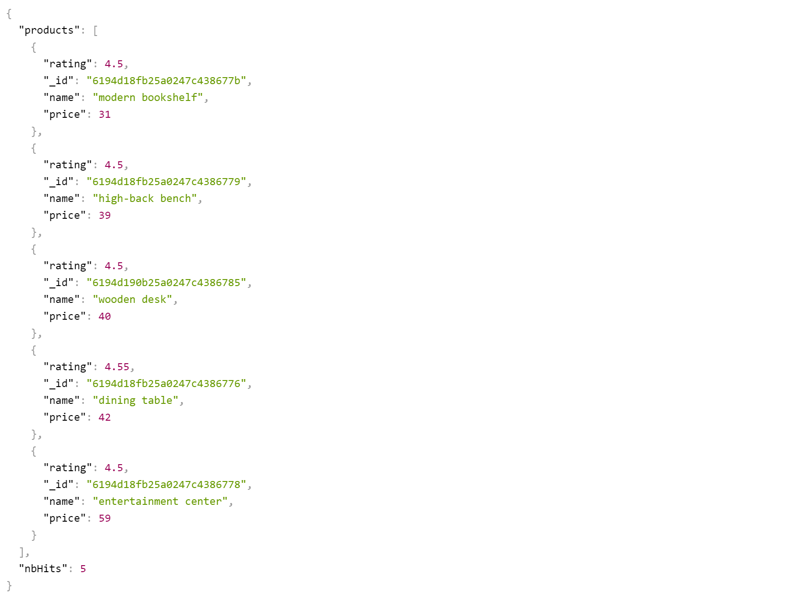

# Store-API

This api has advanced filtering options by passing Query String

## Parameters

- name
  - name=leather sofa
- numericFilters
  - numericFilters=price>30,rating>=4
- sort
  - sort=price,rating
- fields
  - fields=name,price,rating
- limit
  - limit=5

## Example

### URL
  - https://store-api-01.herokuapp.com/api/v1/products?name=e&numericFilters=price>30,rating>=4&sort=price,rating&fields=name,price,rating&limit=5

### Result
  
